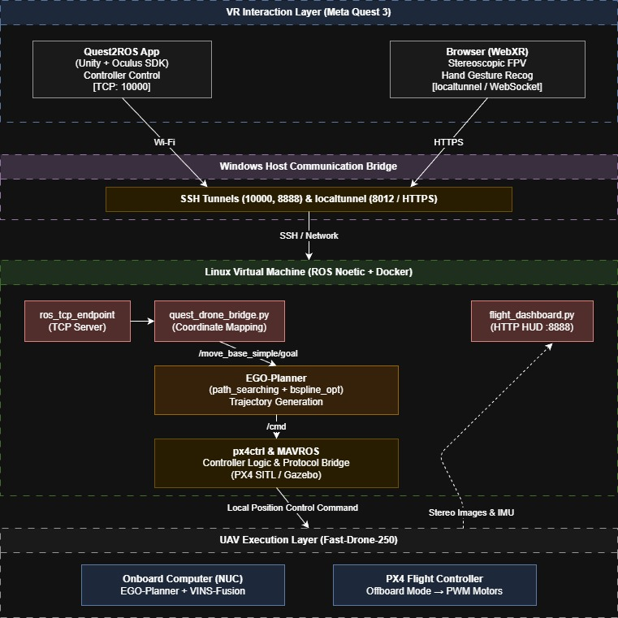
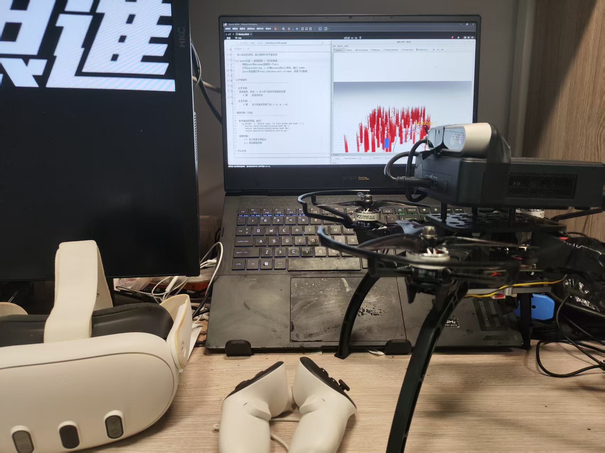
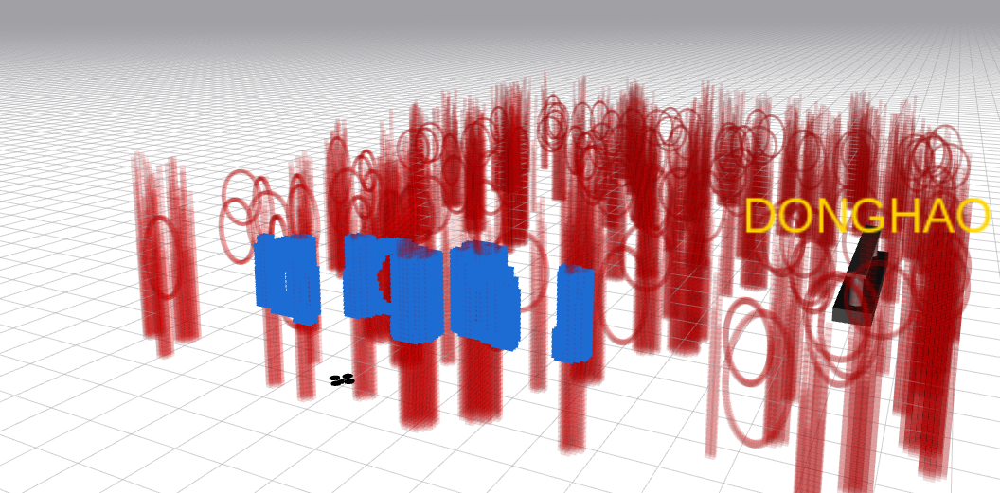
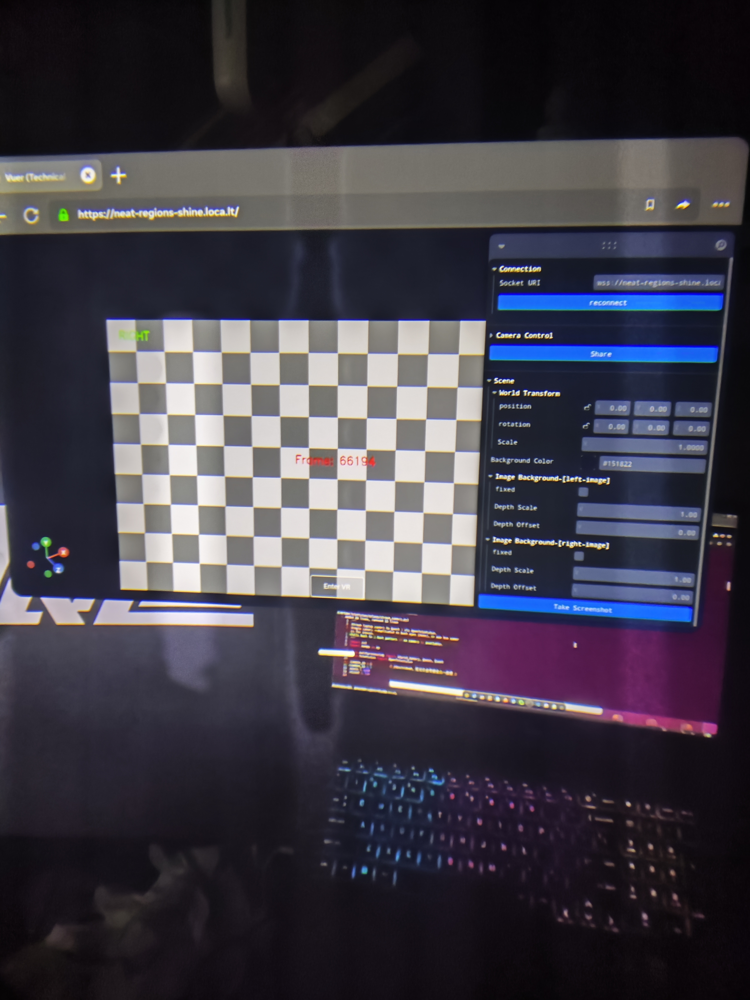

# SpatialPilot (Fast-Drone-250)

> 从零搭建自主空中机器人 | Build an Autonomous Aerial Robot from Scratch

本项目是 [Fast-Drone-250](https://github.com/ZJU-FAST-Lab/Fast-Drone-250) 的实践延伸，包含完整的硬件组装、机载计算机环境配置、代码部署与真机实验流程。可在未知环境中实现自主探索与避障。

---

## 🎥 真机飞行视频

点击下方画面观看飞行演示：

👉 **[下载飞行视频](1.mp4)**

---

## 📸 项目过程展示

| | | |
|:---:|:---:|:---:|
|  |  |  |
| **硬件组装** | **系统调试** | **机架设计** |

---

## 📖 目录

- [第一章：课程介绍](#)
- [第二章：无人机组装](#)
- [第三章：飞控安装与接线](#)
- [第四章：飞控设置与试飞](#)
- [第五章：机载电脑与传感器组装](#)
- [第六章：Ubuntu 20.04 安装](#)
- [第七章：机载电脑环境配置](#)
- [第八章：实验调试软件安装与说明](#)
- [第九章：Ego-Planner 使用说明](#)
- [第十章：VINS 设置](#)
- [第十一章：Ego-Planner 实验](#)

> 详细教程请参阅 [readme_en.md](readme_en.md)

---

## ⚠️ 安全声明

操作空中机器人具有危险性！请严格遵守安全规范！首次试飞请务必寻求有自稳模式飞行经验的飞手协助。

---

## 🛠 技术栈

- **飞控**: PX4 v1.11.0 (CUAV V5)
- **机载电脑**: Intel NUC
- **深度相机**: Intel RealSense D435i
- **SLAM**: VINS-Fusion
- **规划**: Ego-Planner
- **ROS**: Noetic (Ubuntu 20.04)

---

© FAST-LAB, Zhejiang University. 仅供学习交流，严禁商业使用。
